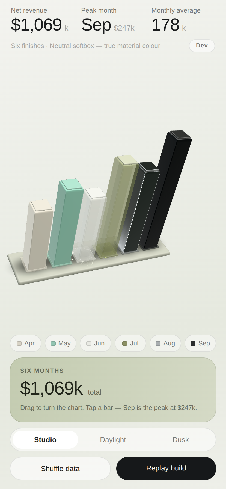
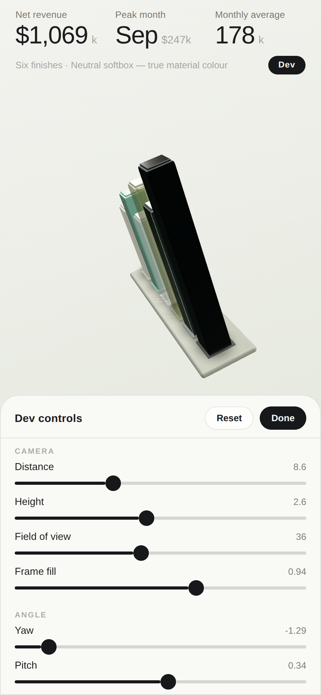

# Glass Chart

An Expo demo app: an interactive 3D bar chart rendered with real-time WebGL,
built as a material showcase.

Six bars on an angled slab, each cast in a different finish — ceramic, plastic,
frosted glass, tinted glass, polished metal, powder-coated metal. Drag anywhere
to turn it, tap a bar to select it, switch the lighting to see the finishes
change character. Edge highlights and caustics track the pointer, or the
device's tilt on a phone. It runs on iOS, Android and the web from one
codebase.



## Running it

```bash
cd apps/glass-chart
npm install
npx expo start          # then press i, a, or w
```

`npx expo start --web` opens it in a browser, which is the quickest way to look
at it. The app has no native custom code, so it runs in Expo Go.

## The material library

`src/chart/materials.ts` holds six `MeshPhysicalMaterial` specs, one per bar:

| Bar | Finish | How it's built |
| --- | --- | --- |
| Apr | Chalk ceramic | Matte, near-zero specular, procedural roughness for unglazed bisque |
| May | Seafoam plastic | Soft body under a hard clearcoat — injection-moulded |
| Jun | Frosted quartz | Translucent shell, high roughness, milky core |
| Jul | Olive glass | Translucent shell, mirror-smooth, tinted core for density |
| Aug | Brushed nickel | Full metal, anisotropic, stretched-noise grain map |
| Sep | Dusted titanium | Metal scattered wide by a powder coat, fine speckle map |

Opaque finishes are one mesh. Translucent ones are drawn as a back-face pass
and a front-face pass over the same geometry, plus an inner core so the glass
reads as cast rather than hollow. three.js sorts transparent objects
far-to-near and breaks the tie between the two passes by creation order, so
the back wall reads through the front without hand-managing `renderOrder`.

The grain, speckle and bisque maps in `src/chart/textures.ts` are generated as
value-noise `DataTexture`s at startup, so the app still ships no image assets.
They matter more than they sound: a perfectly uniform powder coat reads as
plastic, and brushed metal without its grain reads as chrome.

## Lighting

There is no HDRI. `Studio.tsx` builds a scene out of emissive planes — an
overhead softbox, strip lights either side, a back rim, a floor bounce — and
bakes it into a reflection probe with `PMREMGenerator`. The segmented control
swaps between three of these: Studio, Daylight and Dusk.

The surround in each preset is deliberately *dark*. Polished metal is almost
entirely reflection, so a uniformly bright white room gives nickel nothing to
reflect and it renders as flat grey card; real studios put bright sources
against a much darker surround, and that contrast is what makes metal read as
metal. Only what the bars reflect is dark — the canvas is transparent, so the
page behind stays near-white. Direct lights are kept low for the same reason:
heavy ambient flattens a PBR scene into chalk.

Tone mapping is Khronos PBR Neutral, which holds material colour on a
near-white set where ACES washes the highlights out.

On the odd Android GPU that refuses the float render target PMREM needs, the
probe is skipped and the scene falls back to the lights alone.

## Reactive light

Two effects follow a single aim signal (`src/chart/lightInput.ts`), which is
device tilt where a motion sensor reports one and the pointer everywhere else.
Desktop browsers fire no motion events, so they fall through to the pointer
without any platform branching in the scene.

**Edge highlights.** `edgeHighlight.ts` injects a fresnel rim term into each
bar's material with `onBeforeCompile`. The built-in lighting gives a broad
specular lobe; what it will not give is a crisp line along a silhouette edge
that tracks a direction of its own. The term goes in after `opaque_fragment`,
where `outgoingLight` has landed in `gl_FragColor` but before the colour space
conversion, so it is added in linear space like any other light. Every patched
material injects identical source, so three's program cache still hands them
all one compiled program and only the uniform values differ.

**Caustics.** Translucent bars throw filaments onto the slab
(`Caustics.tsx`). The pattern sums the *zero crossings* of two drifting wave
fields rather than the wave values — piling up raw wave energy saturates into
a solid blob the moment the fields agree. It is masked into a ring rather than
a disc, because the bar stands on the middle of that plane and a
centre-weighted pool puts all its light exactly where it cannot be seen. A
second mask measured on the un-offset UV keeps filaments from hanging over the
edge of the slab as the pool slides.

The key light swings with the same aim, so highlights, caustics and the
specular all move together.

## Building in

Bars grow from zero to their value when they first enter the camera frame,
not on mount. On load that is immediately, staggered left to right; it earns
its keep when a bar is off-frame — shuffle or replay while the chart is turned
or zoomed so a bar sits outside the view and it still builds when it comes
back, instead of popping in at full height.

## Dev sheet

The **Dev** button in the header opens a tuning panel: camera distance, height
and field of view, frame fill, yaw and pitch, exposure, how far the light
follows the pointer, edge-highlight strength and falloff, caustic intensity,
bar edge radius, grow duration and stagger, plus toggles for idle sway, edge
highlights and caustics. Reset restores the defaults in `src/devConfig.ts`,
which is the single source for both the sheet's layout and the scene's
starting values. Dragging the chart moves the yaw and pitch sliders too.



## Framing

`Rig.tsx` projects the corners of the chart's bounding box to screen space
every frame and nudges the rig to keep that box centred and filling the canvas.
A row seen at an angle projects both narrower and off-centre — perspective
swings the near end wider than the far end — and by how much depends on the yaw
and the screen, so no fixed scale or offset frames it correctly everywhere.
This is why it looks right on a 320pt phone and on a tablet without a
breakpoint.

## Input

Everything goes through react-three-fiber's own pointer events, which work the
same on touch and mouse, so there is no separate gesture layer to fight with
the raycaster. A press that travels less than a small threshold counts as a tap
and selects a bar; anything further turns the chart and throws it with
momentum. Left alone, the chart sways gently around wherever you left it rather
than spinning away.

## Layout

```
App.tsx                  screen: gradient, stat row, canvas, controls
src/theme.ts             palette and the three lighting presets
src/data.ts              the six data points
src/chart/
  GlassBarChart.tsx      the <Canvas> and its contents
  materials.ts           the six finishes
  textures.ts            procedural grain / speckle / bisque maps
  Rig.tsx                orbit, momentum, tap-vs-drag, auto-framing
  Bar.tsx                one bar, built from a material spec
  Studio.tsx             reflection probe and lights
  Platform.tsx           base slab and contact shadows
  CameraControl.tsx      applies live camera changes from the dev sheet
  Caustics.tsx           filaments cast by the translucent finishes
  edgeHighlight.ts       fresnel rim injected into the bar materials
  lightInput.ts          the shared pointer / tilt aim
  geometry.ts            shared geometry and layout constants
  anim.ts                damping and spring helpers
src/devConfig.ts         dev-sheet schema and default values
src/useTilt.ts           device motion into the aim signal
src/ui/                  the 2D chrome over the canvas, incl. DevSheet
```

## Notes

Grounding is done with soft procedural blobs rather than a shadow pass.
`PCFSoftShadowMap` was removed in three r186, and the remaining soft option
(VSM) needs a float render target that is unreliable on mobile GPUs — and at
this near-horizontal camera angle a real cast shadow adds little that the blobs
don't. Dropping the pass also saves a full shadow render every frame.

## Verification

The scene, materials, interaction and layout were checked by driving the web
build in Chromium at phone, small-phone and tablet sizes, across all three
lighting presets: tap-to-select, drag-to-turn, shuffle, every dev slider and
toggle, and the staggered build captured frame by frame.

Two things could not be checked here. The iOS and Android bundles compile and
resolve the GLView-backed renderer, but the app has not been run on a device
or simulator, so native GPU behaviour — the PMREM probe in particular — is
worth a look on real hardware. And **tilt has only been exercised through its
fallback**: desktop Chromium fires no motion events, so the pointer path is
what ran. The sensor path needs a real phone.
