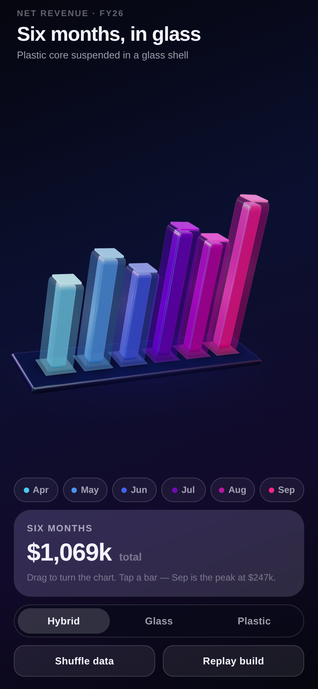

# Glass Chart

An Expo demo app: an interactive 3D bar chart rendered with real-time WebGL,
built to show off glass and plastic materials.

Six bars sit on a slab that is presented on an angle. Drag anywhere to turn it,
tap a bar to select it. It runs on iOS, Android and the web from one codebase.



## Running it

```bash
cd apps/glass-chart
npm install
npx expo start          # then press i, a, or w
```

`npx expo start --web` opens it in a browser, which is the quickest way to look
at it. The app has no native custom code, so it runs in Expo Go.

## What's in the scene

**Materials.** The segmented control at the bottom switches between three
treatments, all `MeshPhysicalMaterial`:

| Mode | What it is |
| --- | --- |
| **Hybrid** (default) | A plastic core suspended inside a glass shell |
| **Glass** | Just the hollow shell — you see straight through to the slab |
| **Plastic** | A solid, full-width glossy bar with a clearcoat |

The glass is drawn as two passes over the same rounded box — back faces, then
front faces — both with `depthWrite` off. three.js sorts transparent objects
far-to-near and breaks the tie between the two passes by creation order, so you
read the back wall of the bar through the front one without having to manage
`renderOrder` by hand.

**Lighting.** There is no HDRI asset. `Studio.tsx` builds a small scene out of
emissive planes — an overhead softbox, cyan and magenta strip lights, a violet
back rim — and bakes it into a reflection probe with `PMREMGenerator`. That
probe is what the glass reflects. Two coloured point lights counter-rotate on
top of it so highlights keep crawling across the bars while the chart sits
still, and each bar has a light inside it that comes up when it is selected.

On the odd Android GPU that refuses the float render target PMREM needs, the
probe is skipped and the scene falls back to the lights alone.

**Framing.** `Rig.tsx` projects the corners of the chart's bounding box to
screen space every frame and nudges the rig to keep that box centred and
filling the canvas. A row seen at an angle projects both narrower and
off-centre — perspective swings the near end wider than the far end — and by
how much depends on the yaw and the screen, so no fixed scale or offset frames
it correctly everywhere. This is why it looks right on a 320pt phone and on a
tablet without a breakpoint.

**Input.** Everything goes through react-three-fiber's own pointer events,
which work the same on touch and mouse, so there is no separate gesture layer
to fight with the raycaster. A press that travels less than a small threshold
counts as a tap and selects a bar; anything further turns the chart and throws
it with momentum. Left alone, the chart sways gently around wherever you left
it rather than spinning away.

## Layout

```
App.tsx                  screen: gradient, header, canvas, controls
src/theme.ts             palette shared by the scene and the UI
src/data.ts              the six data points
src/chart/
  GlassBarChart.tsx      the <Canvas> and its contents
  Rig.tsx                orbit, momentum, tap-vs-drag, auto-framing
  Bar.tsx                one bar: glass shell, plastic core, emissive cap
  Studio.tsx             reflection probe and lights
  Platform.tsx           base slab, contact shadows, colour footprints
  geometry.ts            shared geometry and layout constants
  anim.ts                damping and spring helpers
src/ui/                  the 2D chrome over the canvas
```

## Verification

The scene, materials, interaction and layout were checked by driving the web
build in Chromium at phone, small-phone and tablet sizes. The iOS and Android
bundles compile and resolve the GLView-backed renderer, but the app has not
been run on a device or simulator, so native GPU behaviour — the PMREM probe in
particular — is worth a look on real hardware.
